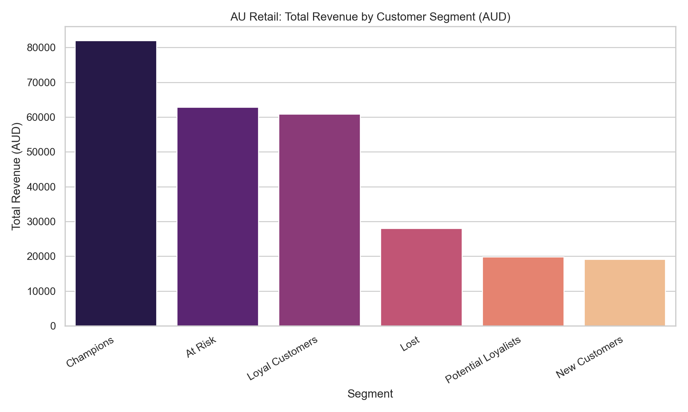
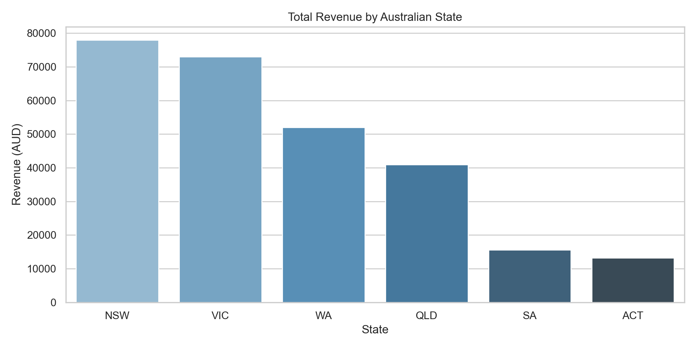
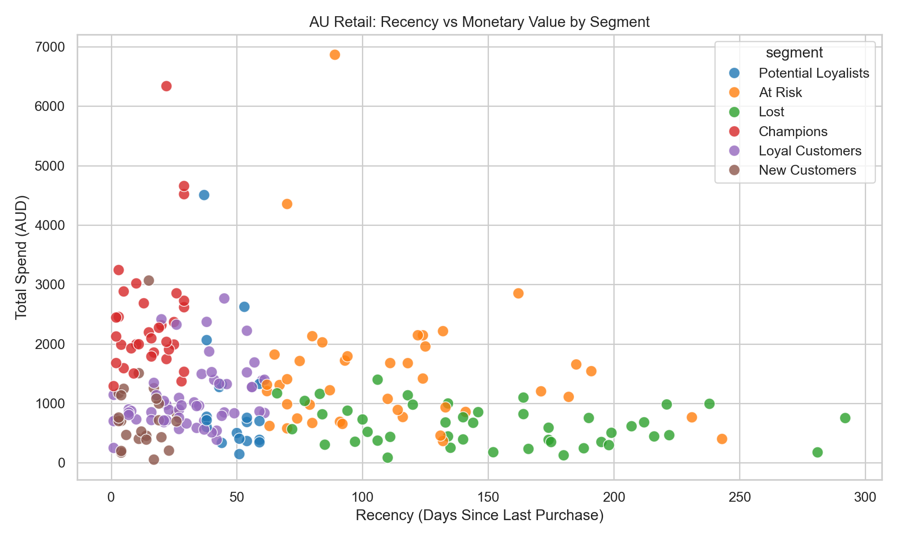

# Australian Retail Strategy: Customer Segmentation Analysis
  

## 📌 Executive Summary
**Date:** April 2026  

I developed a Customer Segmentation model for a leading Australian retailer to turn raw transaction data into a clear marketing roadmap. By analyzing over 220 unique customers, I identified **$62,000+ in revenue at risk** and created a strategy to improve customer retention and sales growth.

---

## 🎯 The Business Challenge
The business was sending the same marketing emails to every customer. This caused:
1. **Wasted Budget:** Spending money on customers who only buy once.
2. **Hidden Churn:** No way to see when high-spending customers stopped shopping.
3. **Regional Gaps:** Missing growth opportunities in **NSW and VIC**.

## 🧮 Methodology
1. Data cleaning & exploration
2. RFM calculation
3. Scoring customers (1–5 scale)
4. Segment classification
5. Business insights & recommendations

---
## 🛠️ Tech Stack & Project Files

- **Language:** Python
- **Libraries:** Pandas, NumPy, Seaborn, Matplotlib
- **IDE:** Visual Studio Code (VS Code)
- **Version Control:** Git
- **Hosting:** GitHub

### 📂 Quick Access
| File | Description |
| :--- | :--- |
| 📊 **[Dataset](data/australian_retail_rfm_sample.csv)** | Raw Simulated AUD 1400 transaction history |
| 🐍 **[Source Code](src/rfm_analysis.ipynb)** | Clean Python script for the analysis |

---

## 📊 Key Insights & Visuals

### 1. The 'Champions' (Our Best Customers)
**Insight:** Our 'Champions' drive 30% of total revenue but make up only 15% of our customers.
**Goal:** We must keep this small group happy to protect our main revenue stream.

### 2. High-Growth Regions
**Insight:** **NSW and VIC** drive over 55% of all national sales.
**Goal:** Focus marketing budget on these two states to get the best return.

### 3. The Churn Danger Zone
**Insight:** We have high-spending customers who haven't shopped in over 60 days. This is our biggest opportunity to recover lost money.

---

## 🚀 2026 Growth Strategy Recommendations

| Segment | Action Plan | Business Goal |
| :--- | :--- | :--- |
| **Champions** | Give VIP perks and early access to sales | Keep our best customers loyal |
| **At Risk** | Send a discount voucher to bring them back | Stop customers from leaving |
| **New Customers** | Offer a discount on their next purchase | Turn one-time buyers into repeat fans |
| **Loyal Customers** | Reward with points or referral bonuses | Increase how often they shop |

---
## 💡 Why This Project Matters

This project demonstrates how data analysis can directly impact business performance, not just generate reports.

- **Drives Revenue Growth:** Identifies high-value customers (Champions) and shows how to retain and expand their spending.
- **Reduces Customer Churn:** Detects "At Risk" customers early, enabling targeted actions to recover lost revenue.
- **Improves Marketing Efficiency:** Moves away from generic campaigns to **data-driven, segmented strategies**.
- **Supports Better Decision-Making:** Provides clear insights that marketing and business teams can act on immediately.
- **Real-World Application:** Reflects real challenges faced by Australian retailers, including regional performance (NSW, VIC) and customer behaviour.

👉 Overall, this project shows the ability to turn raw data into **practical business strategies that increase revenue and reduce costs**.

---

## 👤 Contact & Connect

**Seakleng Ren**  
*Data Analyst / Business Intelligence Specialist*

---
